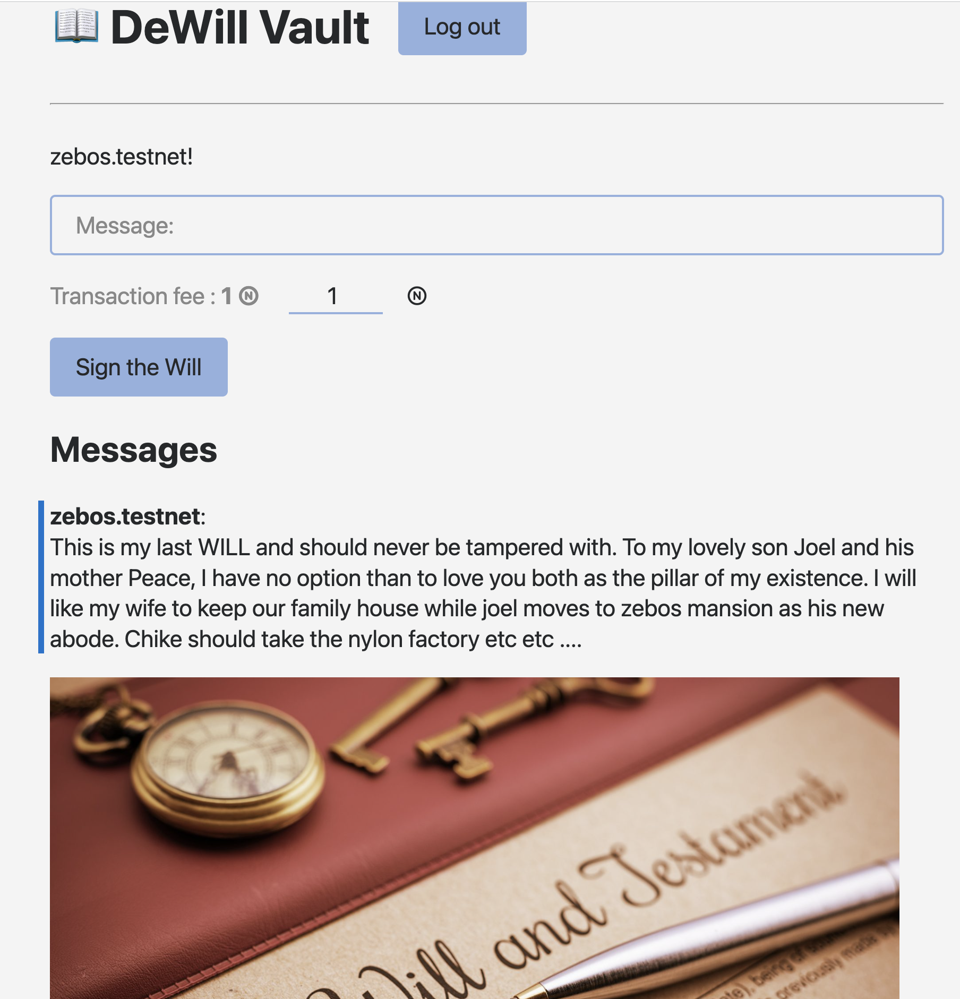

# DeWill Vault 📖 
[](https://docs.near.org/tutorials/welcome)
[](https://gitpod.io/#/https://github.com/near-examples/guest-book-js)
[](https://docs.near.org/develop/contracts/anatomy)
[](https://docs.near.org/develop/integrate/frontend)
[](https://docs.near.org/develop/integrate/frontend)


DeWill Vault is a decentralized Will and Testament storage vault built on Near Ecosystem..




# What This Project does

1. Immutable storage of Wills and Testament
2. Blockchain storage system on $NEAR protocol
3. Easy to use but highly secured
4. Testament protection should be a top priority!

<br />

# Quickstart

Clone this repository locally to reproduce ("https://github.com/stanley07/DeWillVault.git"). Then follow these steps:

### 1. Install Dependencies
```bash
npm install
```


### 2. Deploy the Contract
Build the contract and deploy it in a testnet account
```bash
npm run deploy
```

### 3. Start the Frontend
Start the web application to interact with your smart contract 
```bash
npm start
```

---

# Learn More
1. Learn more about the contract through its [README](./contract/README.md).
2. Check [**our documentation**](https://docs.near.org/develop/welcome).